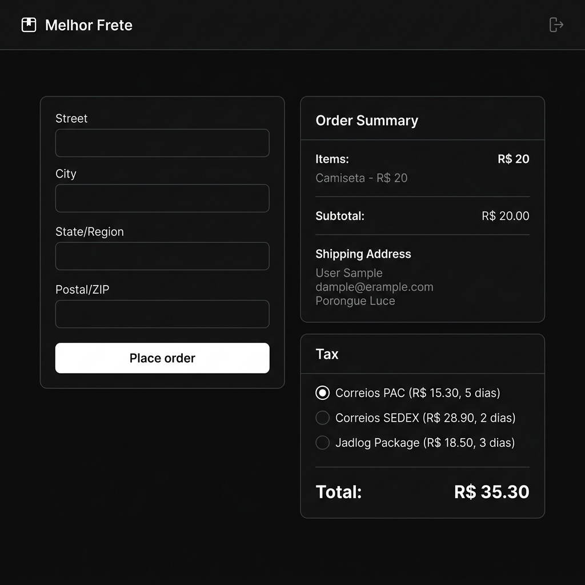

<div align="center">

# 📦 Melhor Frete

**Calculadora de frete em tempo real integrada à API do Melhor Envio.**

[](https://github.com/NobodyDe/melhorfrete/actions)




</div>

---

## ✨ Sobre o Projeto

O **Melhor Frete** é uma aplicação front-end que permite ao usuário calcular cotações de frete em tempo real, comparar transportadoras e compor o valor total de um pedido de forma dinâmica — tudo integrado à **API REST do Melhor Envio**.

O foco técnico do projeto vai muito além da UI: ele demonstra a aplicação de **boas práticas de engenharia de software** desde a arquitetura de estado, tipagem estrita, até a automação de qualidade de código com esteiras de CI/CD.

---

## 🖥️ Funcionalidades

- 📬 **Cotação em tempo real** com múltiplas transportadoras (Correios, Jadlog, etc.)
- ↕️ **Ordenação automática** dos fretes do mais barato para o mais caro
- 🔘 **Seleção interativa** de opção de envio via radio buttons controlados pelo React
- 💰 **Cálculo dinâmico do total** (subtotal + frete selecionado) via `useMemo`
- 🧹 **Sanitização de inputs** em tempo real com Regex
- ✅ **Validação de CEP** com normalização do formato antes do envio

---

## 🏗️ Arquitetura e Decisões Técnicas

A arquitetura segue o princípio de **separação de responsabilidades** de forma modular:

```
src/
├── components/         # UI components (Form, etc.)
├── hooks/              # Custom hooks (encapsulam lógica de negócio)
├── services/           # Camada de comunicação com APIs externas
├── types/              # Contratos de dados TypeScript
└── constants/          # Dados estáticos e Regex centralizados
```

### Por que essa estrutura?

Em projetos escaláveis, o componente React não deve conhecer os detalhes de como os dados são buscados. A lógica de API fica em `services/`, o estado da query em `hooks/`, e o componente apenas **consome** o que precisa.

---

## 🔬 Destaques de Código

### 1. Tipagem Estrita da API Externa

Um dos maiores desafios ao integrar APIs de terceiros é a falta de tipagem. Aqui, criamos **contratos explícitos** para toda a resposta do Melhor Envio:

```typescript
// src/types/shipping.ts

export type ShippingQuote = {
  id: number;
  name: string; // "PAC", "SEDEX", etc.
  price: string; // ⚠️ vem como string: "15.30"
  delivery_time: number;
  error?: string; // presente se o serviço não está disponível
  company: {
    id: number;
    name: string; // "Correios", "Jadlog", etc.
    picture: string;
  };
};
```

> **Por que `price` é `string`?** A API retorna o preço como string `"15.30"`. Documentar isso com um comentário e converter explicitamente com `Number(price)` no consumo é uma prática que **previne bugs silenciosos** de precisão numérica.

---

### 2. Serviço HTTP com Axios Tipado

A camada de serviço encapsula a instância do Axios configurada com o token de autenticação via variável de ambiente, garantindo que **nenhuma credencial seja exposta** no código.

```typescript
// src/services/shippingService.ts

const api = axios.create({
  baseURL: "/melhorenvio/api/v2/me",
  headers: {
    Authorization: `Bearer ${import.meta.env.VITE_MELHOR_ENVIO_TOKEN}`,
    "Content-Type": "application/json",
  },
});

export async function calculateShipping(
  payload: ShippingRequest,
): Promise<ShippingQuote[]> {
  const { data } = await api.post<ShippingQuote[]>(
    "/shipment/calculate",
    payload,
  );
  return data;
}
```

---

### 3. Custom Hook com TanStack Query (useMutation)

A integração com a API é feita via `useMutation`, não `useQuery`, porque o cálculo de frete é uma **ação imperativa** disparada pelo usuário (submit do form), não uma busca automática de dados.

```typescript
// src/hooks/useShippingCalculate.ts

import { useMutation } from "@tanstack/react-query";
import { calculateShipping } from "../services/shippingService";

export function useShippingCalculate() {
  return useMutation({
    mutationFn: calculateShipping,
  });
}
```

> **Padrão de Mercado:** Ao encapsular o `useMutation` em um custom hook, o componente `Form` não tem dependência direta do TanStack Query. Isso facilita a substituição futura por qualquer outra biblioteca de estado/data-fetching sem tocar na UI.

---

### 4. Estado Derivado com useMemo (Zero Re-renders Desnecessários)

O total do pedido, o subtotal e as opções de frete são **estados derivados** — calculados a partir de outros estados, nunca armazenados como estado independente. Isso segue o princípio de **Single Source of Truth**:

```typescript
// src/components/ui/Form.tsx

// Filtra erros e ordena do mais barato para o mais caro
const shippingOptions = useMemo(() => {
  if (!data) return [];
  return data
    .filter((quote) => !quote.error)
    .sort((a, b) => Number(a.price) - Number(b.price));
}, [data]);

// Total nunca é armazenado em useState — é sempre derivado
const total = useMemo(() => {
  if (!selectedShipping) return subtotal;
  return subtotal + Number(selectedShipping.price);
}, [subtotal, selectedShipping]);
```

---

## 🛠️ Stack Tecnológica

| Tecnologia            | Versão | Função                                            |
| --------------------- | ------ | ------------------------------------------------- |
| **React**             | 19     | UI reativa e gerenciamento de estado local        |
| **TypeScript**        | ~6.0   | Tipagem estática e segurança de contratos         |
| **TanStack Query**    | v5     | Gerenciamento de estado de servidor (useMutation) |
| **Axios**             | ^1.15  | Cliente HTTP com instância configurada            |
| **Vite**              | 8      | Build tool e dev server ultrarrápido              |
| **Tailwind CSS**      | v4     | Estilização utility-first                         |
| **tailwind-variants** | ^3     | Variantes de componentes tipadas                  |
| **Prettier**          | ^3     | Formatação de código padronizada                  |
| **ESLint**            | ^9     | Análise estática e prevenção de bugs              |
| **Husky**             | ^9     | Git hooks para qualidade no pré-commit            |
| **lint-staged**       | ^16    | Linting apenas nos arquivos alterados             |
| **commitlint**        | ^20    | Padronização de mensagens de commit               |

---

## ⚙️ CI/CD Pipeline

Todo Pull Request e push para `main` aciona automaticamente a esteira de CI no **GitHub Actions**:

```yaml
# .github/workflows/ci.yml
steps:
  - Checkout repository
  - Install pnpm
  - Set up Node.js 20 with pnpm cache
  - Install dependencies (--frozen-lockfile)
  - Run ESLint
  - Type Check (tsc --noEmit)
```

A validação local acontece em **duas camadas** via Husky:

- **`pre-commit`** → roda `lint-staged` (ESLint + Prettier nos arquivos alterados)
- **`commit-msg`** → roda `commitlint` (força o padrão `feat:`, `fix:`, `chore:`, etc.)

---

## 🚀 Como Rodar Localmente

```bash
# 1. Clone o repositório
git clone https://github.com/NobodyDe/melhorfrete.git
cd melhorfrete

# 2. Instale as dependências
pnpm install

# 3. Configure as variáveis de ambiente
cp .env.example .env
# Preencha VITE_MELHOR_ENVIO_TOKEN com seu token do Melhor Envio

# 4. Rode o servidor de desenvolvimento
pnpm run dev
```

> **Pré-requisito:** Conta ativa no [Melhor Envio](https://melhorenvio.com.br) para obter o token de API.

---

## 📄 Variáveis de Ambiente

| Variável                  | Descrição                                           |
| ------------------------- | --------------------------------------------------- |
| `VITE_MELHOR_ENVIO_TOKEN` | Token Bearer de autenticação da API do Melhor Envio |

---

<div align="center">

Feito com foco em **qualidade de código** e **boas práticas de engenharia**.

</div>
